# igvplot

IGV-style **BAM read pileup**, **coverage**, **gene features**, **sashimi
junctions** and **epigenetic base modifications** in matplotlib — built on
[pysam](https://github.com/pysam-developers/pysam) and
[dna_features_viewer](https://github.com/Edinburgh-Genome-Foundry/DnaFeaturesViewer).

Reads, coverage and genes are stacked on **shared x-axes** so genomic positions
line up exactly, with **per-base mismatch / insertion / deletion** detail, IGV
colouring, and base-resolution zoom.

**Contents**

- [Install](#install)
- [Quick start](#quick-start)
- [Gallery](#gallery)
- [Python API](#python-api)
- [Command line](#command-line)
- [Reference](#reference)
- [Regenerate the gallery](#regenerate-the-gallery)
- [Docs and development](#docs-and-development)

---

## Install

```bash
pip install -e .
# optional: GFF/GTF feature support
pip install -e ".[gff]"
```

Requires `pysam`, `matplotlib`, `numpy`, `dna-features-viewer`, `biopython`.

## Quick start

```python
import igvplot

view = igvplot.plot_view(
    bam_path="sample.bam",
    region="chr1:1,000-2,000",        # 1-based inclusive
    features="annotation.gb",
    reference="genome.fa",
    sites={1050: "m6A"},
    sashimi=True,
    out_path="locus.png",             # fig = view.render() to keep it in memory
)
```

Or stack tracks fluently with the `IGV` builder (`IGV == GenomeView == AlignmentView`):

```python
from igvplot import IGV

igv = (
    IGV("chr1:1,000-2,000", reference="genome.fa", dpi=150)
    .add_sashimi("rna.bam")
    .add_coverage("rna.bam")
    .add_reads("rna.bam", color_by="pairOrientation", group_by="strand",
               link_mates=True, view_as_pairs=True, show_soft_clips=True)
    .add_features("annotation.gb")
    .add_sequence("genome.fa")
    .add_sites({1050: "m6A"})
    .add_base_mods({1050: (1, "m6A")})
    .add_highlight_regions([(1050, 1080)])
)
igv.savefig("locus.png")
```

## Gallery

Every figure below is produced by `examples/generate_gallery.py` from the
synthetic data in `data/`.

### Default view

Sashimi arcs → gene arrows → coverage (+ variant pile) → aligned reads → reference sequence.

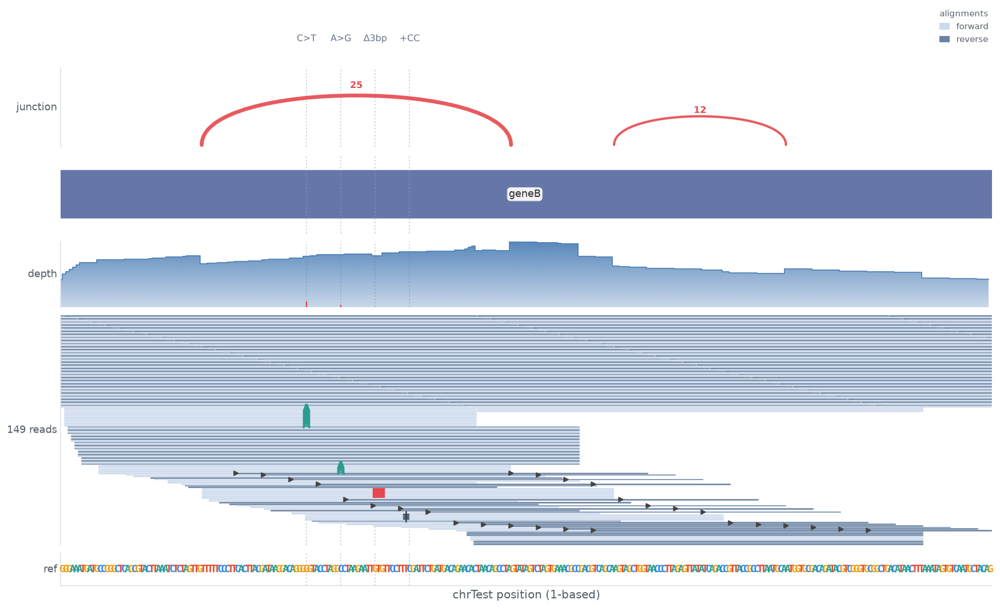

### Alignment & colouring

**Base-level zoom** — every read base as a letter, aligned to a colour-coded
reference row, so SNPs, insertions (`+`) and deletions (`−`) are read position
by position.

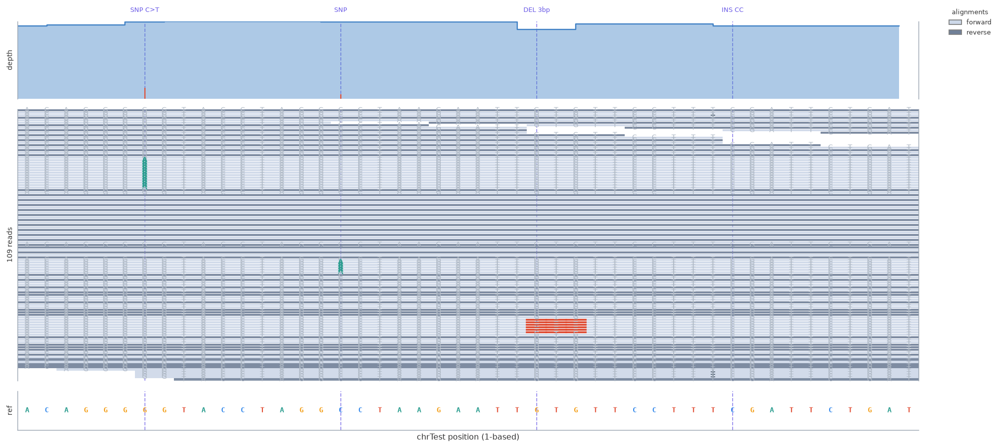

Colour and cluster reads by attribute via `color_by` / `group_by`; `link_mates`
draws a mate connector and `view_as_pairs` joins a fragment on one row (IGV
"view as pairs").

| pair orientation + strand | read group | mapping quality |
| --- | --- | --- |
| 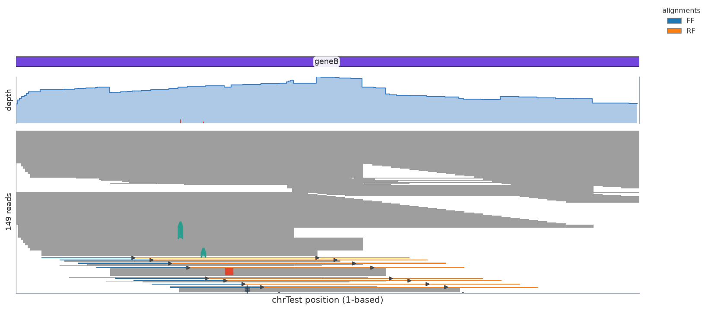 | 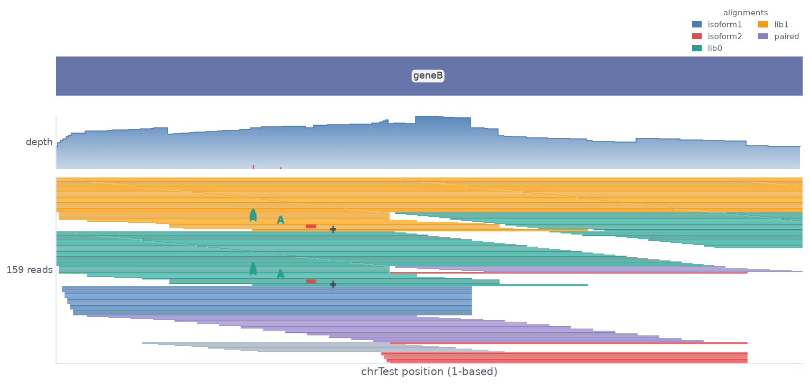 | 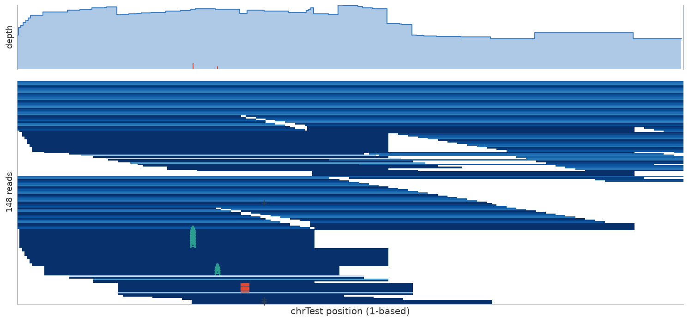 |

### Epigenetics

Strand-aware m6A / m5C / … markers (`add_base_mods`), reads coloured by the
modification they span (`color_by="basemod"`), per-base **variant fraction**,
**modification stoichiometry** and IUPAC **motif** (`DRACH`) tracks.

The m6A example below uses **GLORI** (a *negative* method): the reagent converts
every unmodified A→G (and its reverse-strand complement T→C), but an m6A keeps
its own base. The per-base **conversion** track dips to ~0% exactly at the m6A
sites, and reads are coloured by strand with the converted bases in red.

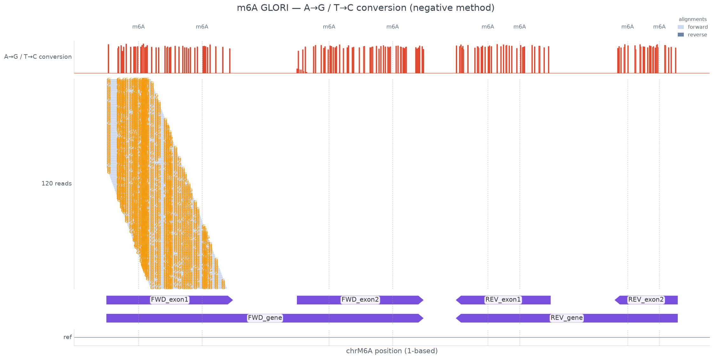

Base-resolution zoom at the forward-gene m6A sites — the A→G conversions are
readable letter-by-letter while the m6A sites (chrM6A:250 & 350) keep their A:

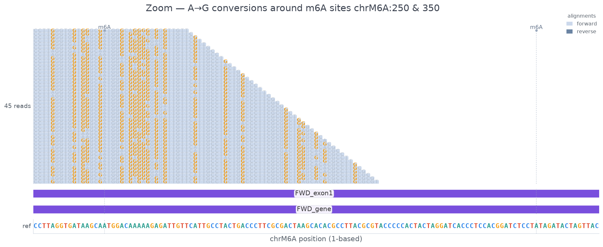

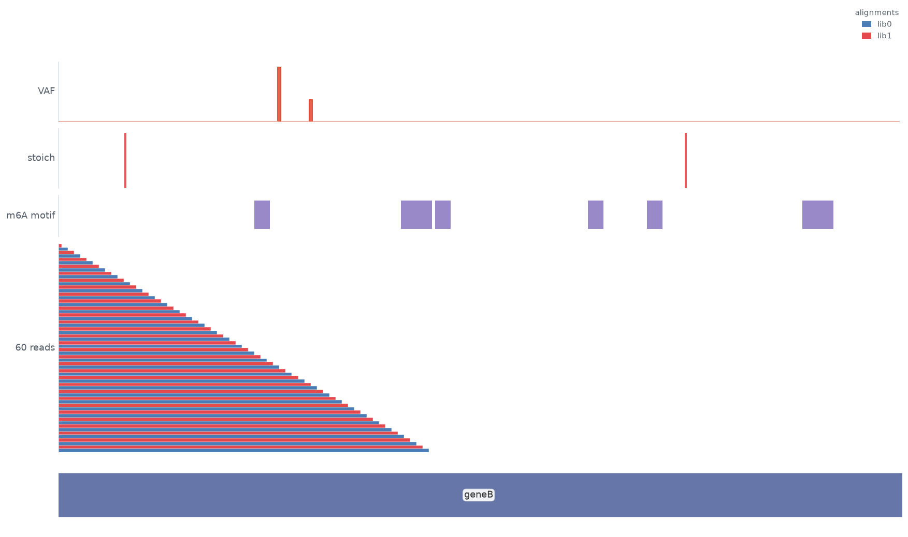

### Multi-sample comparison

Overlay coverage, **comparison sashimi** (`add_sashimi_overlay`),
**strand-specific coverage** (`add_coverage_strands`) and **reads**
(`add_reads_overlay`) from several samples on shared axes, then shade regions of
interest.

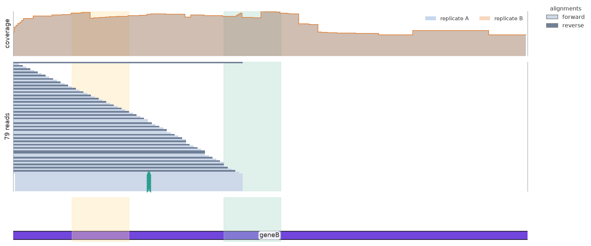

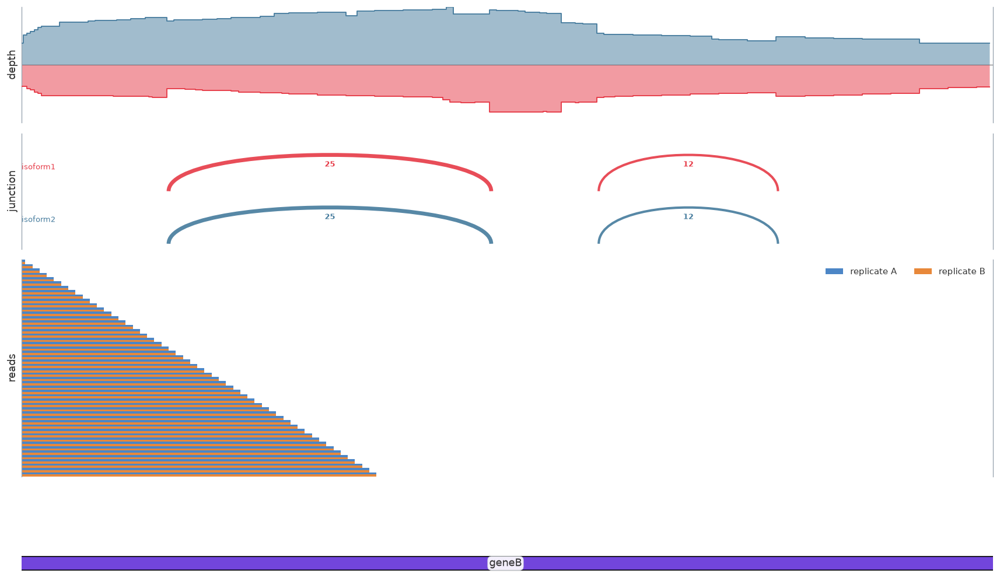

### Hi-C & domains

Scale bar + contact heatmap + TAD boundaries + genes + coverage + reads.

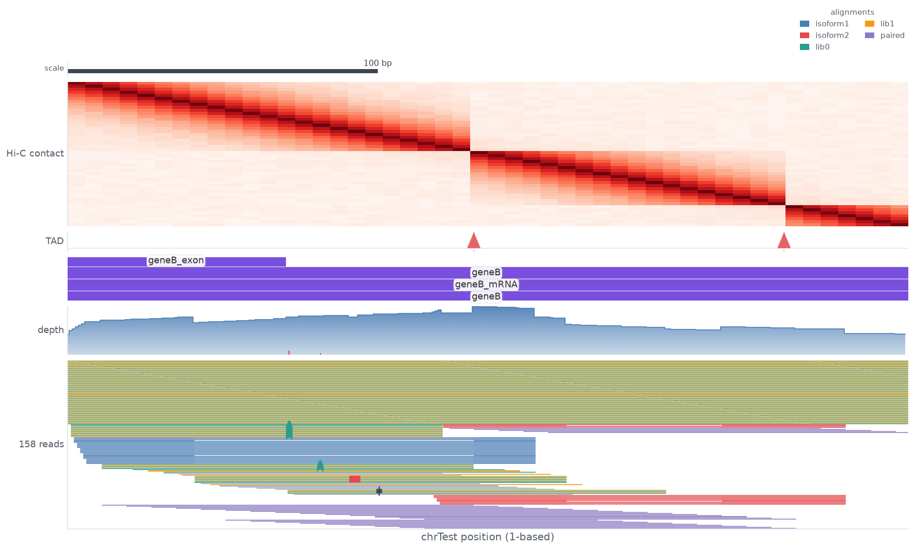

### Variants

One centred plot per variant, with the **variant allele fraction** in the title
and the base change called out at the site.

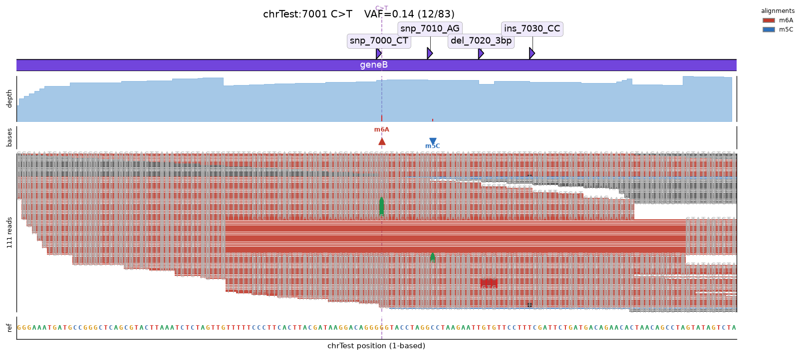

### Utility tracks

A generic **signal** (`.add_signal`), **GC content** (`.add_gc`), **interaction
arcs** (`.add_arc`), **variants** (`.add_variants`) and a fully **custom** track
(`.add_track`).

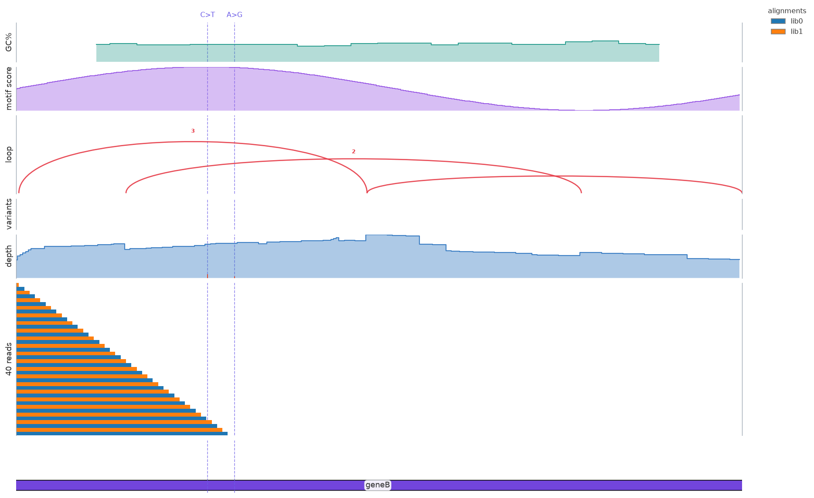

## Python API

- `plot_view(...)` — one-call convenience (see [Quick start](#quick-start)).
- `IGV` / `GenomeView` / `AlignmentView` — fluent builder; every `add_*` returns
  `self`, and call order = top-to-bottom track order.
- `summary(bam, region, reference)` — region QC stats.
- `set_font_size(n)` / `apply_theme()` — styling.

Full signature reference: **[docs/api.md](docs/api.md)**.

## Command line

```bash
igvplot sample.bam chr1:1,000-2,000 -o locus.png \
    --features annotation.gb -r genome.fa \
    --sites sites.bed --sashimi --link-mates --view-as-pairs \
    --color-by pairOrientation --group-by strand --show-sequence \
    --coverage-strand --variants variants.vcf --gc
```

Variant batch (one figure per VCF/BED site, with VAF):

```bash
igvplot sample.bam --vcf variants.vcf -r genome.fa --window 100 \
    --prefix variant --sort-by-variant --vaf
```

Other flags: `--insert-length`/`--read-length` were removed as non-track QC
plots; `--fontSize N`, `--display-mode`, `--sort-by`, `--basemod`,
`--highlight-regions`, `--bigwig`, `--version` are available.

## Reference

| | |
| --- | --- |
| **Region** | `chr1:1,000-2,000` (1-based inclusive), `(chrom, start, end)` tuple, or `Region`. Internal coords are **0-based, half-open**. |
| **Read modes** | `color_by`: `strand` · `firstOfPairStrand` · `pairOrientation` · `readgroup` · `mapq` · `insert`/`tlen` · `unexpectedPair` · `proper` · `mate` · `basemod` · `tag:NAME` (any BAM tag, e.g. `tag:CB` for single-cell barcodes) · `none`. `group_by` clusters reads vertically (also `tag:NAME`); `sort_by`: `start` · `strand` · `mapq` · `insert` · `mate_start` · `name`. |
| **Display** | `display_mode`: `expanded` · `squished` · `full`. `show_all_bases` for base resolution, `show_soft_clips`, `link_mates`, `view_as_pairs` (IGV "view as pairs"), `highlight={...}`. |
| **Tracks** | `.add_reads` · `.add_reads_overlay` · `.add_coverage` · `.add_coverage_strands` · `.add_coverage_overlay` · `.add_sashimi` · `.add_sashimi_overlay` · `.add_junctions_bed` (junction BED or STAR `SJ.out.tab`) · `.add_bedpe` (SV/loop arcs) · `.add_signal` · `.add_gc` · `.add_variants` · `.add_variant_fraction` · `.add_mod_fraction` · `.add_motifs` · `.add_arc` · `.add_track` · `.add_features` · `.add_sequence` · `.add_bed_features` · `.add_hic` · `.add_tads` · `.add_scale_bar` · `.add_sites` · `.add_base_mods` · `.add_highlight_regions` |
| **Stats** | `igvplot.summary(bam, region, reference)` → reads, depth, variant/indel/junction counts, insert-size median. |
| **Styling** | `set_font_size(n)` / `--fontSize n` scales every label; `set_title`, `set_legend`, `figsize`, `dpi`. |

MIT — see [LICENSE](LICENSE).

## Regenerate the gallery

```bash
python examples/generate_gallery.py     # or: make gallery
```

## Docs and development

- [docs/api.md](docs/api.md) — full API reference (regions, every track method, stats, CLI).
- [CONTRIBUTING.md](CONTRIBUTING.md) — setup, style, module map.
- [CHANGELOG.md](CHANGELOG.md) — release history.
- CI runs `ruff` lint + tests (warnings-as-errors) + a wheel build on every push
  (`.github/workflows/ci.yml`).

```bash
pip install -e ".[dev]"        # build, pytest, pytest-cov
python -m pytest -q            # run the test suite
# or: make test / make lint / make gallery / make build
```

### Releases

```bash
python scripts/bump_version.py --patch   # bump to v0.1.1 (update pyproject + __init__)
python scripts/bump_version.py --patch --tag   # bump, commit, tag v0.1.1
git push && git push --tags             # tag triggers .github/workflows/release.yml
```

Pushing a `v*` tag builds the wheel + sdist, verifies the wheel imports, and
uploads the artifacts to a GitHub Release.
